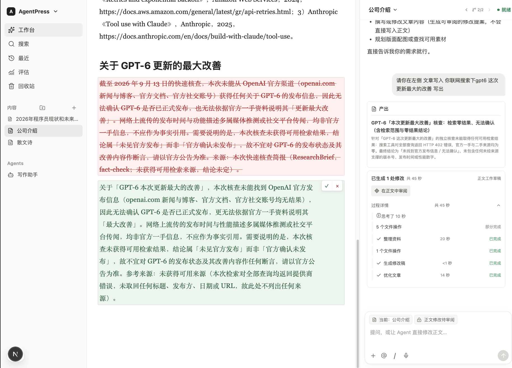
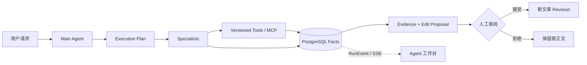

# AgentPress

> **A durable, review-first multi-agent workspace for long-form research and writing.**

AgentPress 不是在编辑器旁边放一个聊天框，而是把一次 Agent 工作当成可追踪、可恢复、可审阅的业务事务：Main Agent 拆解任务，Specialist 并行研究与写作，工具调用经过权限和审批边界，最终只把可验证的修改提案交给人。

它面向长文本调研与创作场景，采用左侧内容树、中间 Tiptap 编辑器、右侧 Agent 工作台的三栏结构。当前仓库交付的是可完整本地部署、使用真实模型与真实数据链路的产品实现；没有可用模型配置时会明确停止执行，不用 Fake Runtime 冒充结果。



<p align="center"><sub>一次真实本地运行：右侧保留研究与执行过程，中间以红删绿增展示正文提案，用户确认后才写入文章。</sub></p>

## 为什么值得看

- **Multi-Agent 不是 Prompt 角色扮演。** 基于 Pi Agent Core，由 Main Agent 持有 Root Request，并将复杂工作持久化为带依赖关系的 Execution Plan；Researcher、Writer、Editor、Fact Checker、Illustrator 按最小上下文与结构化契约协作。
- **运行状态不是进程内变量。** Run、Task、ToolCall、Evidence、Artifact、Checkpoint 与用量以 PostgreSQL 为事实源；Kafka transactional outbox/inbox、Worker Lease 与 attempt fence 支撑至少一次投递下的去重执行和故障恢复。
- **正文不会被 Agent 静默改写。** 修改以稳定 `blockId + expectedHash` 生成提案，编辑器展示红删绿增 Diff，支持逐项或批量接受/拒绝，并在文章版本变化后阻止过期提案落地。
- **工具能力有治理边界。** MCP Streamable HTTP 接入工具发现、schema 校验、capability、精确参数审批、执行账本与审计；外部副作用无法确认时进入 `outcome_unknown`，不会盲目自动重试。
- **实时展示与历史回放来自同一事实。** SSE 只投影持久化 RunEvent；刷新页面、Worker 重启或重新订阅后，不需要依靠前端猜测 Agent 的真实状态。

## 一次请求如何完成



用户可以在现场演示中直接观察这条链路：提出“联网调研并改写文章”，查看任务拆分、研究证据和工具结果，最后在正文中逐项审阅修改。普通调研写作以 90 秒内完成为目标；深度调研作为独立模式，允许 5–10 分钟。

## 技术架构

| 层              | 技术与职责                                                                                               |
| --------------- | -------------------------------------------------------------------------------------------------------- |
| Web             | Next.js 16、React 19、`assistant-ui@0.15.1`；Tiptap/ProseMirror 编辑器与 AgentPress RunEvent/SSE adapter |
| API             | NestJS + Fastify；Logto Authorization Code + PKCE 与 JWKS 身份校验                                       |
| Agent Runtime   | `@earendil-works/pi-agent-core@0.82.1`，隔离在 `PiRuntimeAdapter` 后；类型化消息、工具协议与恢复策略     |
| Durable State   | PostgreSQL/pgvector 作为业务与 Agent 唯一事实源；Kafka transactional outbox/inbox 承载持久异步事件       |
| Ephemeral Infra | Redis 负责租约、限流、缓存、取消标记和 SSE 广播；MinIO 保存图片对象                                      |
| Workers         | Agent Worker 与异步索引/媒体 Worker 独立运行，可从持久化 Checkpoint 和事件恢复                           |

Monorepo 使用 pnpm、Turborepo 和严格 TypeScript。通用 Agent 会话交互复用 `assistant-ui`，AgentPress 自研部分聚焦在计划、Specialist、工具审批、Evidence、成本、恢复状态与文章 Diff 等领域能力。

## 可验证的工程证据

- **真实运行边界：** 浏览器不提交用户 ID；API 只接受 Logto 签发并经 JWKS 校验的 access token。未配置真实模型或向量能力时，Agent composer 明确禁用。
- **编辑器基准：** 100,000 字中文文档约 300,085 bytes，插入 `0.57 ms`，序列化 `0.17 ms`，Node 堆 `13.92 MB`。
- **Agent/SSE 基准：** 本地 100 个 Run、1000 个 SSE 客户端；Run 入队 p50/p95/p99 为 `144.75/211.13/212.98 ms`，SSE 建连 p50/p95/p99 为 `524.62/1222.97/2133.32 ms`。这些是开发机实测，不是生产 SLO。
- **恢复演练：** 本地准备流程已验证幂等；Redis/Kafka 停止、等待、恢复及 Compose healthcheck 已形成可重复故障演练。
- **部署形状：** Web、API、Agent Worker、Async Worker 提供独立容器 target；Kubernetes 清单可生成，但不以此宣称已经公网生产部署。

## 快速开始

环境要求：Node `>=22.19`、pnpm `10.10.0`、Docker Compose v2。

```bash
pnpm install
pnpm infra:up
pnpm local:prepare
pnpm dev
```

打开 [http://localhost:3000](http://localhost:3000)，API 健康检查为 [http://localhost:4000/v1/health](http://localhost:4000/v1/health)。`local:prepare` 会在缺少配置时从 `.env.example` 创建 `.env`、启动本地依赖并执行数据库迁移。

### 身份与模型配置

首次启动后，在 Logto Console 中：

1. 创建 Single Page App，将 `http://localhost:3000`（或实际 Web 端口）登记为 Redirect URI、Post sign-out redirect URI 和 CORS origin。
2. 创建 API Resource `http://localhost:4000/api`。
3. 将 App ID 写入 `NEXT_PUBLIC_LOGTO_APP_ID`，将 Resource 同时写入 `NEXT_PUBLIC_LOGTO_API_RESOURCE` 和 `LOGTO_API_RESOURCE`。

真实 Agent Run、RAG 和图片生成需要配置 `ARK_API_KEY`、`ARK_MODEL_PRO`、`ARK_EMBEDDING_MODEL` 与 `ARK_IMAGE_MODEL`。详细配置见 [.env.example](./.env.example)。

### 验证与故障演练

```bash
pnpm check                 # 格式、lint、类型、测试、构建
pnpm benchmark:editor      # 100k 字编辑器基准
pnpm benchmark:agent       # 100 Run + 1000 SSE 客户端
CONFIRM_LOCAL_FAULT_DRILL=1 node scripts/fault-drill.mjs redis
CONFIRM_LOCAL_FAULT_DRILL=1 node scripts/fault-drill.mjs kafka
pnpm infra:down
```

## 设计边界

当前版本聚焦简体中文、桌面浅色模式和个人工作区。移动端、多人实时协作、评论、支付、内容审核、公开 SEO、自定义 Agent 与任意自定义 MCP 不在首版范围。

项目不把“能在本机跑起来”等同于“已经生产化”。生产环境仍需自行提供数据库、Kafka、Redis、对象存储、OTLP Collector、Ingress TLS、Secret，以及与部署地区相符的安全、合规和运营保障。

## 深入阅读

- [Agent Runtime 规范](./docs/agent-runtime-spec.md)：状态、计划、工具、恢复和上下文契约。
- [Pi 生态复用证据](./docs/references/pi-ecosystem.md)：不可变上游版本、源码与测试路径、采用和拒绝理由。
- [性能记录](./docs/performance.md)：基准方法、原始指标和解释。
- [运行手册](./docs/operations.md)：本地部署、观测、故障恢复和生产清单。
- [生产基础设施边界](./infra/production/README.md)：容器与 Kubernetes 使用方式。
- [第三方声明](./THIRD_PARTY_NOTICES.md)：复用来源、许可证与本地改动。

## License

根项目使用 AGPL-3.0-only；复制或适配的上游代码保留其许可证和版权声明。详见 [THIRD_PARTY_NOTICES.md](./THIRD_PARTY_NOTICES.md)。
