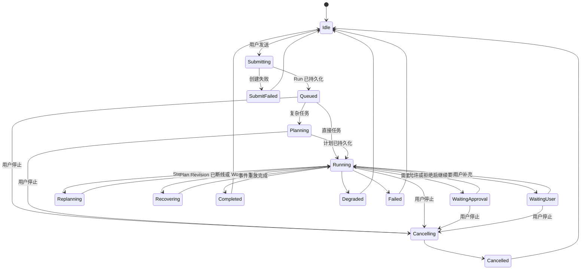
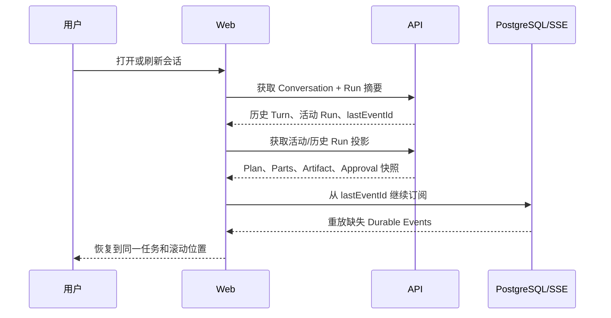

# AgentPress Agent 对话交互规格

> 状态：Draft 0.1  
> 日期：2026-07-31  
> 范围：桌面浅色版个人工作区  
> 视觉基准：`docs/references/ui/notion-agent-editor-reference.png`  
> 交互参考：LibreChat `f7bc50ae5b752e50fab7f97ee00531ca1264ea05`（MIT，仅作为本规格的行为参考）

## 1. 执行摘要

AgentPress 将把右侧 Agent 工作台从“运行时检查器”重构为“围绕文章任务持续工作的 AI 对话界面”。用户通过一个统一 Composer 提交目标、文章上下文、选中段落、文件和 Skill；Agent 的计划、工具活动、审批、研究来源、文章修改和最终交付按发生顺序进入消息流；中间编辑器继续作为文章事实源，所有正文修改都可从对话定位到正文并以红删绿增方式审核。

本次重构不改变“一次 Root Request 对应一个 Main Agent Run”的领域约束，也不暴露私有推理。它改变的是这些运行时对象如何被用户感知：Conversation 是可返回的长期工作上下文，Run 是一次可恢复的任务，Message Part 是过程的可读投影，Artifact 是可打开和继续处理的交付物。

## 2. 问题与目标

### 2.1 已确认的问题

- 当前消息只承载纯文本，计划、工具、审批、Evidence 和文章 Diff 集中在消息列表底部的单一检查器中，过程与对应消息缺少因果关系。
- 前端只在内存保存当前 `runId`；刷新后恢复稳定消息，但无法发现和恢复当前或历史 Run 的状态投影。
- “引导”“后续”“Run”“Checkpoint”“Skill 版本”等内部概念直接进入主交互，要求普通作者理解运行时模型。
- 上下文与 Skill 通过复选框和 Markdown 编辑器暴露，缺少 `@`、`/`、附件和选中正文等自然输入方式。
- 文章修改在 430px 右栏内审核，与中间正文缺少定位和联动。
- 当前计划由关键词和固定角色模板生成，用户看到的“计划”与具体目标结合不足。

### 2.2 产品目标

1. 用户在任意时刻都能回答：Agent 正在做什么、为什么做、是否需要我操作、产物在哪里。
2. 页面刷新、切换文章或短暂断网后，可以恢复同一 Conversation、活动 Run 和已确认的 UI 状态。
3. 用户不需要理解底层状态机，也能自然地开始、补充、调整、排队或取消任务。
4. 工具调用、引用、审批和修改提案与产生它们的对话轮次绑定，可审计但默认低干扰。
5. Agent 的研究、提纲、草稿、图片方案和文章修改形成可打开、可引用、可继续操作的 Artifact。

### 2.3 非目标

- 不把 AgentPress 改造成全屏通用聊天产品。
- 不在首版提供模型供应商切换、自定义 Endpoint、Agent Marketplace 或自定义 MCP。
- 不展示模型私有思维链、隐藏 Prompt、凭据或未经脱敏的工具输出。
- 不改变 PostgreSQL 作为 Agent 状态事实源的约束。
- 不用通用 Artifact 编辑器替代中间的 Tiptap 文章编辑器。

## 3. 目标用户与核心任务

### 3.1 主要用户

内容作者、编辑和自媒体运营者。他们关注选题、事实、表达和最终文章，不应承担 Agent 工程配置工作。

### 3.2 Jobs-to-be-Done

- 当我面对一篇文章时，我希望直接说明目标并带上相关上下文，以便 AI 不需要我反复复制材料。
- 当任务较复杂时，我希望知道 AI 当前进度和是否卡住，但不想阅读技术日志。
- 当 AI 要联网、生成图片、发布或修改正文时，我希望理解影响并保留最终控制权。
- 当 AI 完成工作后，我希望直接查看研究来源、修改位置和最终产物，并能继续追问。
- 当我刷新或稍后回来时，我希望继续原任务，而不是重新描述背景。

🔶 **Assumption：**主要用户更重视“结果可用和过程可信”，而不是模型、Token 与工具参数的完全可见性。需通过可用性测试验证。

## 4. 设计原则

1. **对话是主线，运行详情是附属。** 所有用户可见事件按时间进入对应消息轮次，技术细节折叠展示。
2. **先说人话，再给参数。** 默认展示动作、对象、影响和结果；toolId、argument hash、revision 等进入“技术详情”。
3. **上下文贴近输入。** 文章、选区、文件、Skill 和引用以 Composer Chip 表达，不放在消息流末尾。
4. **只在需要时打断。** 只读和低风险动作自动执行；用户输入、付费动作和副作用使用内联卡片请求决定。
5. **正文是事实源。** 对话负责解释和控制，中间编辑器负责展示和接受文章修改。
6. **任务必须可返回。** 每个 Run 都有稳定身份、状态、摘要和产物，刷新后可恢复。
7. **不伪装成思维链。** 展示可验证的计划、动作、结果和简要理由，不展示内部推理过程。

## 5. 产品信息架构

```text
Workspace
├── 内容树
│   ├── 文件夹 / 文章
│   └── Agent 会话入口
├── 文章编辑区
│   ├── 当前文章事实源
│   ├── 选中 Block / 选区
│   └── Agent Diff 审核层
└── Agent 工作台
    ├── Conversation Header
    ├── Message Timeline
    │   └── Run Turn
    │       ├── User Message
    │       ├── Plan Part
    │       ├── Activity Parts
    │       ├── Approval / Question Part
    │       ├── Artifact Parts
    │       └── Final Answer
    └── Unified Composer
```

### 5.1 用户可见对象

| 对象         | 用户含义                     | 默认可见信息                           |
| ------------ | ---------------------------- | -------------------------------------- |
| Conversation | 围绕一篇文章或主题的长期对话 | 标题、绑定文章、更新时间               |
| Run          | 一次明确任务                 | 用户目标、状态、当前步骤、结果摘要     |
| Plan         | Agent 准备完成的步骤         | 具体动作、进度、必要的角色，不强调 DAG |
| Message Part | 一次过程或结果事件           | 自然语言摘要、状态、可用动作           |
| Artifact     | 可继续使用的交付物           | 类型、标题、版本、打开/插入/下载动作   |
| Evidence     | 支撑回答或文章声明的来源     | 标题、域名、时间、引用片段、对应声明   |

## 6. 页面总体线框

```text
┌───────────────┬────────────────────────────────┬──────────────────────┐
│ AgentPress    │ 写作素材 / 当前文章       ··· AI│ 写作助手       新对话 │
│               │                                │ 当前文章 · 会话标题  ▾ │
│ 搜索          │        文章标题                ├──────────────────────┤
│ 最近          │                                │ 用户：帮我重写开头…  │
│               │        正文                    │                      │
│ 写作素材      │                                │ 已制定 3 步计划   2/3 │
│ ▾ 文件夹      │   ┌──────────────────────┐     │ ✓ 分析当前文章       │
│   当前文章    │   │ Agent 修改建议       │     │ ✓ 核查背景资料       │
│   其他文章    │   │ 红删 / 绿增           │◀────│ ◉ 生成修改提案       │
│               │   │ 接受  拒绝            │     │                      │
│ Agent 会话    │   └──────────────────────┘     │ 文章修改 · 2 处       │
│   当前会话    │                                │ [在正文中查看]        │
│   历史任务    │                                │                      │
│               │                                │ 已完成。主要调整了…   │
│               │                                ├──────────────────────┤
│               │                                │ 当前文章 ×  /写作规范×│
│               │                                │ 继续告诉 Agent…       │
│               │                                │ ＋  @  /  工具       ↑ │
└───────────────┴────────────────────────────────┴──────────────────────┘
```

### 6.1 布局规则

- 左栏继续承担内容导航，并增加“新对话”和最近 Agent 会话入口；不在左栏展示 Specialist 列表。
- 中栏保持无卡片包裹的文章编辑器。Agent 修改仅在对应 Block 周围出现低干扰标记。
- 右栏默认宽度 420–480px，可拖拽调整；小于 1180px 时允许覆盖式展开，不要求首版移动端适配。
- Composer 固定在右栏底部；消息区独立滚动；活动审批到达时保证可见但不强制抢焦点。

## 7. Conversation Header

```text
┌────────────────────────────────────┐
│ 写作助手                ＋新对话  ···│
│ 当前文章 · “重写文章开头”      ▾   │
└────────────────────────────────────┘
```

### 7.1 必需能力

- 展示会话标题和绑定文章。
- 新建会话，不清空或覆盖旧会话。
- 下拉切换当前文章下的历史会话。
- 更多菜单包含重命名、搜索本会话、导出和归档。
- 活动 Run 存在时，切换会话前提示“任务将在后台继续”，而不是取消任务。

### 7.2 会话标题

- 首条用户消息提交后由 Agent 生成不超过 24 个中文字符的标题。
- 用户可随时重命名。
- 如果首条消息失败，使用用户输入前 24 个字符作为临时标题。

## 8. Unified Composer

### 8.1 默认状态

```text
┌────────────────────────────────────┐
│ 当前文章 ×   选中 2 个段落 ×       │
│                                    │
│ 告诉 Agent 你想完成什么…           │
│                                    │
│ ＋附件  @上下文  /技能  工具      ↑ │
└────────────────────────────────────┘
```

### 8.2 上下文 Chip

| 类型     | 示例               | 行为                                    |
| -------- | ------------------ | --------------------------------------- |
| 文章     | `当前文章 ×`       | 默认随当前文章加入，可移除              |
| 正文选区 | `选中 2 个段落 ×`  | 绑定稳定 blockId/hash；失效时发送前提示 |
| 文件     | `行业报告.pdf ×`   | 显示上传、解析、可用或失败状态          |
| Skill    | `/深度研究 ×`      | 运行开始时锁定版本，普通用户不见版本号  |
| 引用     | `引用上一条回答 ×` | 绑定消息或 Artifact ID                  |

### 8.3 命令入口

- `+`：上传文件、添加图片、从素材库选择。
- `@`：当前文章、正文 Block、其他文章、文件和内置 Specialist。
- `/`：搜索并启用写作 Skill；进入独立管理页后才允许编辑 Skill 内容。
- `工具`：联网研究、工作区检索、图片生成等能力开关。默认使用“自动”。
- 回车发送，Shift+Enter 换行；运行中发送规则见 8.4。

### 8.4 运行中发送

用户无需预先选择“Steering”或“Follow-up”。

- 活动 Run 处于 `planning` 或 `running` 时，普通发送默认记录为“补充当前任务”，在下一安全边界生效。
- 发送按钮旁菜单提供“完成后继续”，将内容排入 Follow-up 队列。
- 已提交但尚未生效的补充以 Composer 上方 Chip 展示，可撤销。
- 如果当前 Run 已进入不可安全调整的收尾阶段，系统自动转为 Follow-up，并明确提示。

```text
待应用：重点缩短前两段 ×
┌────────────────────────────────────┐
│ 再加一个要求…                      │
│                      完成后继续 ▾ ↑ │
└────────────────────────────────────┘
```

## 9. 消息时间线与 Message Parts

### 9.1 时间线规则

- 一个 User Message 开始一个 Run Turn。
- 与该 Run 有关的 Plan、Task、Tool、Approval、Artifact、Evidence 和结果都渲染在该 Turn 内。
- Durable Event 决定稳定 UI；token delta 只更新当前文本 Part。
- 历史 Turn 不因新 Run 开始而丢失或被新的检查器覆盖。
- 默认只展示对作者有意义的摘要；技术详情通过展开项提供。

### 9.2 Part 类型

| Part             | 用途                           | 默认形态            |
| ---------------- | ------------------------------ | ------------------- |
| `text`           | Agent 对用户的解释与最终回答   | Markdown 文本       |
| `plan`           | 任务步骤和进度                 | 可折叠步骤组        |
| `activity`       | 搜索、读取、分析、生成等动作   | 单行状态或分组卡片  |
| `tool-approval`  | 副作用或付费工具审批           | 高显著度决定卡      |
| `ask-user`       | 缺少必要输入                   | 选项/短答卡         |
| `evidence`       | 来源与引用                     | 引用 Chip＋来源抽屉 |
| `article-change` | 文章修改提案                   | 摘要卡＋正文定位    |
| `artifact`       | 研究报告、提纲、草稿、图片方案 | 可打开的产物卡      |
| `warning`        | 降级、失败、未核验内容         | 非阻塞警告          |
| `recovery`       | 断线、恢复、重放               | 低干扰状态行        |
| `usage`          | 时间、Token、费用              | 完成后折叠详情      |

### 9.3 消息级操作

AI 稳定消息悬停后展示：

- 复制。
- 重新生成为新的 Run。
- 查看引用。
- 从此处分支。
- 赞同/不满意。
- 展开本轮执行详情。

用户消息悬停后展示：编辑并重新提交、复制、从此处分支。

## 10. 计划与实时进度

### 10.1 计划卡片

```text
┌ 已制定 3 步计划                         2/3 ┐
│ ✓ 理解文章开头的问题                        │
│ ✓ 核查需要保留的事实                        │
│ ◉ 生成并检查修改提案                        │
│                                      查看详情 │
└─────────────────────────────────────────────┘
```

- 步骤文案必须与本次目标相关，禁止显示通用模板文案。
- 默认显示最多 5 个顶层步骤；复杂依赖、Specialist、重试和 Acceptance Criteria 放入详情。
- 进行中步骤展示简短动态描述，但不展示思维链。
- Replan 时在原卡片中显示“计划已根据你的补充更新”，允许查看版本差异。
- Direct Run 默认不显示空计划或“v0”。

### 10.2 状态文案

| 运行时状态                   | 用户文案                 |
| ---------------------------- | ------------------------ |
| `queued`                     | 正在准备任务             |
| `planning`                   | 正在制定步骤             |
| `running`                    | 正在执行：{当前动作}     |
| `waiting_for_approval`       | 等待你确认               |
| `waiting_for_user`           | 需要你的补充             |
| `recovering`                 | 连接已恢复，正在继续任务 |
| `completed`                  | 已完成                   |
| `completed_with_degradation` | 已完成，部分内容未能核验 |
| `failed`                     | 未能完成                 |
| `cancelling`                 | 正在安全停止             |
| `cancelled`                  | 已停止                   |

## 11. 工具调用与审批

### 11.1 普通工具活动

只读工具默认以过程摘要呈现：

```text
✓ 搜索了 4 组关键词，保留 6 个来源
✓ 阅读当前文章和 2 篇工作区材料
```

点击后才展示工具名称、版本、参数摘要、耗时和输出摘要。原始 JSON 不进入默认 UI。

### 11.2 审批卡

```text
┌ 需要你的确认 ──────────────────────────────┐
│ 准备生成 1 张文章封面                        │
│ 将消耗约 8 积分，生成结果保存到当前工作区。   │
│ 不会自动发布，也不会覆盖现有图片。             │
│                                             │
│ [取消]                           [允许生成]   │
│ ▸ 查看技术详情                               │
└─────────────────────────────────────────────┘
```

审批卡必须回答：

1. 将执行什么动作。
2. 作用于什么对象。
3. 是否可撤销或会覆盖内容。
4. 是否产生费用或外部副作用。
5. 用户拒绝后的影响。

- 决定提交期间禁用重复点击并显示状态。
- 审批失败时保留卡片和重试入口。
- 多个审批不能只展示第一个；按产生顺序逐项处理或明确批量范围。
- `outcome_unknown` 必须使用独立警告卡，禁止显示为普通失败并提供自动重试。

## 12. Ask User

Agent 缺少必要信息时，使用内联问题卡，不用一段普通文本后静默等待。

```text
┌ 需要你选择写作方向 ────────────────────────┐
│ 这篇文章主要面向哪类读者？                   │
│ ○ 新手读者                                   │
│ ○ 行业从业者                                 │
│ ○ 大众读者                                   │
│ [补充说明……]                     [继续]      │
└─────────────────────────────────────────────┘
```

- 支持 2–4 个推荐选项和短文本补充。
- 回答写入当前 Run，并在下一安全边界继续。
- 用户可稍后回答；切换会话不丢失等待状态。

## 13. Evidence 与引用

### 13.1 回答内引用

最终回答中的事实声明使用 `[1]`、`[2]` 等可点击引用标记。点击后在右栏内打开来源抽屉：

- 标题和域名。
- 作者/发布时间/抓取时间（可用时）。
- 支撑当前声明的引用片段。
- 工作区文档 revision 或网页快照 hash。
- 打开原文或工作区材料。

### 13.2 来源摘要

```text
来源 6
[1] 官方发布说明   [2] 行业报告   [3] 当前文章
[查看全部来源]
```

- Evidence 不是普通文本列表，来源必须可操作。
- 无法核验的声明必须在最终回答和文章修改说明中标记为“未核验”。
- 引用失效时保留历史快照信息，不静默删除引用。

## 14. Artifact 与正文联动

### 14.1 Artifact 类型

首版支持：

- `ResearchBrief`：研究摘要、来源和未解决问题。
- `Outline`：文章提纲。
- `ArticleDraft`：新文章或完整草稿。
- `EditProposal`：针对已有文章的修改。
- `ClaimReview`：事实声明核查结果。
- `ImagePlan` / `AssetProposal`：图片方案和待插入素材。

### 14.2 Article Change 卡片

```text
┌ 文章修改 · 2 处 ───────────────────────────┐
│ 重写开头并压缩背景说明，未改变核心观点。       │
│                                             │
│ [在正文中查看]                    [全部接受]  │
│                              ··· 更多操作     │
└─────────────────────────────────────────────┘
```

- “在正文中查看”定位第一处修改，并在中栏启用红删绿增审核层。
- 中栏提供上一处/下一处、接受、拒绝；右栏同步更新计数。
- “全部接受”只作用于当前 Proposal，并在执行前显示影响范围。
- 过期 Proposal 显示冲突摘要，不能沿用普通接受按钮。
- 应用完成后，卡片保留结果状态和目标 revision，不能从历史消息中消失。
- `operationId` 与 `expectedHash` 是 host 基于当前 Run 绑定 revision 派生的事实；模型输入只提供稳定 `blockId`、操作类型和修改内容，避免复制不透明锚点造成伪 stale 错误。Proposal 仍在服务端按 revision 原子预检并 fail-closed。
- `article.propose_edits` 的模型输入是 insert/replace/delete/move/update_attrs 五类封闭 DTO；block `attrs` 保持开放键值以承载 TipTap 节点属性，因此该工具不请求 Provider strict sampling，但仍在 Pi coercion 前和 Tool Registry 执行前分别按同一宿主 schema 严格校验。省略 insert.afterBlockId 表示按调用顺序追加，显式 null 表示插入文首；宿主生成缺失的新 blockId，并拒绝重复 ID、已删除目标和逆序引用。

### 14.3 非正文 Artifact

- 在消息中显示标题、摘要、版本和主动作。
- 支持打开、插入文章、继续修改、下载；具体动作按 Artifact 类型限制。
- 新版本不覆盖旧版本，卡片可切换历史版本。

## 15. Run 与 Conversation 状态流



### 15.1 前端恢复流程



恢复期间：

- 稳定历史立即可读，不用全屏 Loading。
- 活动 Turn 顶部显示“正在恢复任务状态”。
- 重放结束后再允许审批或发送 Steering，避免对过期快照操作。
- 如果没有活动 Run，仍加载所有历史 Run Parts，而不是只加载文本消息。

## 16. 空状态与首次使用

不展示“尚未创建 Agent Run”或运行时配置术语。

```text
写作助手

我可以围绕当前文章帮你研究、写作和修改。

[分析文章结构]  [查证关键事实]
[重写文章开头]  [生成配图方案]

当前文章已加入上下文
```

- 推荐动作根据当前文章是否为空、是否有选区、是否有 Evidence 动态变化。
- 运行时不可用时显示“写作助手暂时不可用”和恢复/查看配置入口；不在消息流中伪装成 Assistant 回复。
- 没有当前文章时仍允许开始独立研究或创建草稿，但明确产物去向。

## 17. 错误、取消与降级

| 场景               | 交互要求                                                      |
| ------------------ | ------------------------------------------------------------- |
| SSE 断开           | 保留已稳定内容，显示重连状态；恢复后去重重放                  |
| Run 创建失败       | 用户消息保留为未发送状态，可重试，不追加一条伪 Assistant 错误 |
| 工具失败           | 在对应 activity 中展示影响和可选恢复动作                      |
| Optional Task 失败 | 继续执行，最终回答明确披露缺失部分                            |
| Required Task 失败 | 展示失败原因、重试或调整任务；不生成看似成功的最终回答        |
| 用户取消           | 立即停止新调度；说明已完成动作和无法撤回的副作用              |
| Proposal 过期      | 展示正文冲突，要求重新生成或进入显式覆盖流程                  |
| `outcome_unknown`  | 告知结果可能已经发生，提供核对入口，禁止自动重试              |

## 18. 功能需求与验收标准

### P0：任务连续性

**FR-01：Run 历史投影**

- Conversation API 必须返回或可查询每个 Root Request 对应的 Run 摘要。
- Web 可以加载活动 Run 和历史 Run 的稳定 Parts、Artifact、Approval 和最终状态。
- 刷新活动任务页面后，用户无需输入即可恢复任务观察。

**验收：**在 `planning`、`running`、`waiting_for_approval`、`recovering` 四种状态分别刷新页面，状态和已完成步骤正确恢复；同一 Durable Event 不重复显示。

**FR-02：按 Turn 组织消息部件**

- 每个 Run 的所有 Parts 绑定 `runId + sequence`。
- 开始新 Run 不得覆盖历史 Run 的计划、工具或产物。
- Parts 按事件顺序稳定排序，token delta 不产生重复稳定 Part。

**验收：**完成三轮包含工具调用的对话后刷新，三轮的过程和结果顺序不变。

**FR-03：可理解的计划**

- Planned Run 的步骤必须基于当前目标生成具体描述。
- Direct Run 不展示计划空壳。
- Steering 触发 Plan Revision 时展示变更原因和影响。

**验收：**不同任务不会得到完全相同的通用计划文案；更新要求后，只重新执行受影响的未结任务。

### P1：核心交互

**FR-04：统一 Composer**

- 支持文章、Block、文件、Skill、引用 Chip。
- 支持 `@`、`/` 和附件入口。
- 运行中默认补充当前任务，允许显式排队为后续任务。

**验收：**用户可在不离开 Composer 的情况下完成“选择两段正文＋启用 Skill＋上传参考文件＋发送任务”。

**FR-05：工具与审批 Part**

- 工具活动默认显示人类可读摘要。
- 审批展示动作、对象、影响、成本、可撤销性和拒绝影响。
- 所有待审批项都能独立决定并恢复。

**验收：**用户不展开技术详情也能准确复述审批后会发生什么。

**FR-06：正文修改联动**

- Article Change 卡可定位中栏对应修改。
- 右栏和中栏决策状态同步。
- 应用后保留审计结果与目标 revision。

**验收：**包含至少三处修改的 Proposal 可以逐项接受/拒绝，刷新后状态不丢失。

**FR-07：Evidence 引用**

- 回答内引用可定位来源详情。
- 来源详情包含引用片段和不可变版本信息。
- 未核验声明必须明确标记。

**验收：**所有标记为有来源的事实均可从回答点击到持久化 Evidence。

### P2：长期使用能力

**FR-08：会话管理**

- 支持新建、重命名、切换、搜索、分支和归档。
- 文章可拥有多个会话；会话可以没有文章绑定。

**FR-09：Artifact 历史**

- Artifact 支持版本、打开、继续修改和按类型执行动作。
- 历史版本不可被新生成结果覆盖。

**FR-10：消息操作与反馈**

- 支持复制、重新生成、编辑重试、分支和反馈。
- 重新生成创建新 Run，不篡改旧 Run。

## 19. API 与前端投影要求

### 19.1 建议新增的只读接口

```text
GET /conversations/:conversationId
GET /conversations/:conversationId/branches/:branchId/turns
GET /conversations/:conversationId/branches/:branchId/runs
GET /runs/:runId
GET /runs/:runId/projection
GET /runs/:runId/artifacts
```

`RunProjection` 至少包含：

```ts
type RunProjection = {
  runId: string;
  rootMessageId: string;
  status: string;
  mode: 'direct' | 'planned';
  activePlanRevision?: number;
  parts: readonly RunPart[];
  artifacts: readonly ArtifactSummary[];
  pendingInteraction?: ApprovalSummary | UserQuestionSummary;
  lastEventId: number;
  createdAt: string;
  completedAt?: string;
};
```

🔶 **Assumption：**为了保证重放一致性，推荐由服务端生成稳定 `RunProjection`，前端 reducer 只合并其后的事件；是否物化投影需要结合查询性能决定。

### 19.2 assistant-ui 适配边界

- 继续使用 `assistant-ui@0.15.1` 的 Thread、Message、Composer 和消息操作能力。
- AgentPress adapter 将领域 `RunPart` 映射为 assistant-ui 可渲染的结构化 Message Parts。
- AgentPress 特有的 Plan、Approval、Evidence、Article Change 和 Artifact 使用自有 renderer，但必须处于对应 Message/Turn 内。
- 不再维护独立于消息时间线的全局 `RunInspector`。

## 20. 成功指标

当前没有真实用户基线，以下目标均为🔶 **Assumption**，上线埋点后重新校准。

### 20.1 主要指标

- **任务有效完成率：**开始 Run 后，用户获得最终回答或接受至少一个 Artifact 的比例，目标 ≥ 75%。

### 20.2 次要指标

- 刷新后活动任务恢复成功率 ≥ 99%。
- 等待审批状态下的有效决定率 ≥ 80%。
- 文章修改提案“打开正文查看”比例 ≥ 60%。
- Proposal 打开后至少完成一项决定的比例 ≥ 70%。
- 用户为同一文章发起第二轮对话的比例较当前基线上升 30%。
- 因不理解状态而取消任务的比例低于 10%。

### 20.3 体验质量指标

- 5 名目标用户中至少 4 名无需指导即可完成“附带文章上下文发起修改、查看进度、审核正文修改”。
- 用户能在 10 秒内指出当前任务状态和下一步是否需要自己操作。
- 审批理解测试中，至少 80% 用户能准确描述动作对象、影响和可撤销性。

## 21. 分期交付

### Phase 1：可靠的对话任务骨架（P0）

- Conversation/Run 查询与投影。
- 历史 Run 恢复和 SSE 接续。
- Run Turn 与结构化 Message Parts。
- 计划、活动、恢复、最终回答的时间线呈现。
- 移除全局 `RunInspector`。

### Phase 2：可控制的 Agent（P1）

- Unified Composer、上下文 Chip、`@`、`/`、附件。
- 运行中补充与 Follow-up 队列。
- Tool Approval、Ask User、错误和 `outcome_unknown` 卡片。
- Evidence 引用与来源抽屉。

### Phase 3：写作产物闭环（P1）

- Artifact 模型与卡片。
- Article Change 和中栏正文联动。
- ResearchBrief、Outline、ClaimReview、ImagePlan。

### Phase 4：长期使用能力（P2）

- 会话重命名、搜索、分支和归档。
- Artifact 版本历史。
- 消息级重新生成、编辑重试、反馈。
- 行为指标与可用性优化。

每个 Phase 应作为独立可验收功能完成测试后提交，避免与无关功能混入同一提交。

## 22. 风险与缓解

| 风险                            | 影响                   | 缓解                                                              |
| ------------------------------- | ---------------------- | ----------------------------------------------------------------- |
| 前端 Parts 与后端事件双重事实源 | 刷新前后 UI 不一致     | 服务端稳定投影＋事件序号幂等合并                                  |
| 计划仍是固定模板                | 新 UI 放大“假 Agent”感 | Phase 1 同时定义计划生成契约，Phase 2 前替换模板规划              |
| 消息流信息过多                  | 对话重新变成日志       | 默认摘要、进行中合并、技术详情折叠                                |
| Steering 重跑过多任务           | 成本高且响应慢         | 只取消/重建受影响的未结任务                                       |
| Proposal 与正文 revision 冲突   | 错误覆盖文章           | 保留 expectedHash、过期检测和显式冲突流程                         |
| 直接借用 LibreChat 代码         | 破坏领域边界或遗漏声明 | 优先复用 assistant-ui；复制前锁定 commit、评估许可证、登记 NOTICE |

## 23. 开放问题

1. 🔵 **Open Question：**会话是否默认永久绑定创建时文章，还是允许稍后切换主文章？建议首版允许解绑，不允许直接换绑，避免上下文歧义。
2. 🔵 **Open Question：**运行中的普通发送默认 Steering 是否符合作者预期？需在可用性测试中与“默认 Follow-up”比较。
3. 🔵 **Open Question：**`RunProjection` 是请求时计算还是物化存储？需结合历史长会话性能评估。
4. 🔵 **Open Question：**首版文件类型是否只开放 PDF/DOCX/Markdown/TXT，图片是否仅用于视觉模型？
5. 🔵 **Open Question：**文章 Diff 的“全部接受”是否需要二次确认？建议普通提案不需要，跨文章、过期或覆盖冲突时必须确认。
6. 🔵 **Open Question：**Token 与美元费用是否继续直接展示给普通用户？建议默认展示“积分和耗时”，技术详情中保留 Token/美元。

## 24. LibreChat 参考边界

本规格参考 LibreChat 的以下交互模式：

- Composer 附件、Mention、Skill、Tool 入口。
- 运行中 Steering 与待处理指令 Chip。
- Tool Call、Tool Approval、Ask User、Subagent 等结构化消息内容。
- Artifact、消息操作、分支和可恢复流。

不参考：

- 多供应商模型选择器和 Custom Endpoint 主流程。
- Agent Marketplace 和通用 Agent 创建器。
- 通用代码 Artifact 作为产品主产物。
- 允许用户配置任意远程或 stdio MCP。

如进入代码复用阶段，必须先核对上游文件的实际许可证与依赖边界，锁定不可变 commit，保留版权声明，并在 `THIRD_PARTY_NOTICES.md` 记录上游路径、本地路径和修改内容。当前文档只参考行为，不包含 LibreChat 源代码。

## 25. PRD 自评

- **最强部分：**交互对象、状态恢复、消息部件和正文联动已经与现有 Agent Runtime 领域模型对齐。
- **最弱部分：**缺少真实用户行为数据，成功指标暂时是待验证假设。
- **最需要验证的假设：**运行中发送默认 Steering、普通作者需要的过程透明度、费用信息的展示层级。
- **建议下一步：**先为 Phase 1 产出前后端契约设计和组件拆分，随后制作可点击的右栏原型进行 5 人任务测试，再进入实现。
